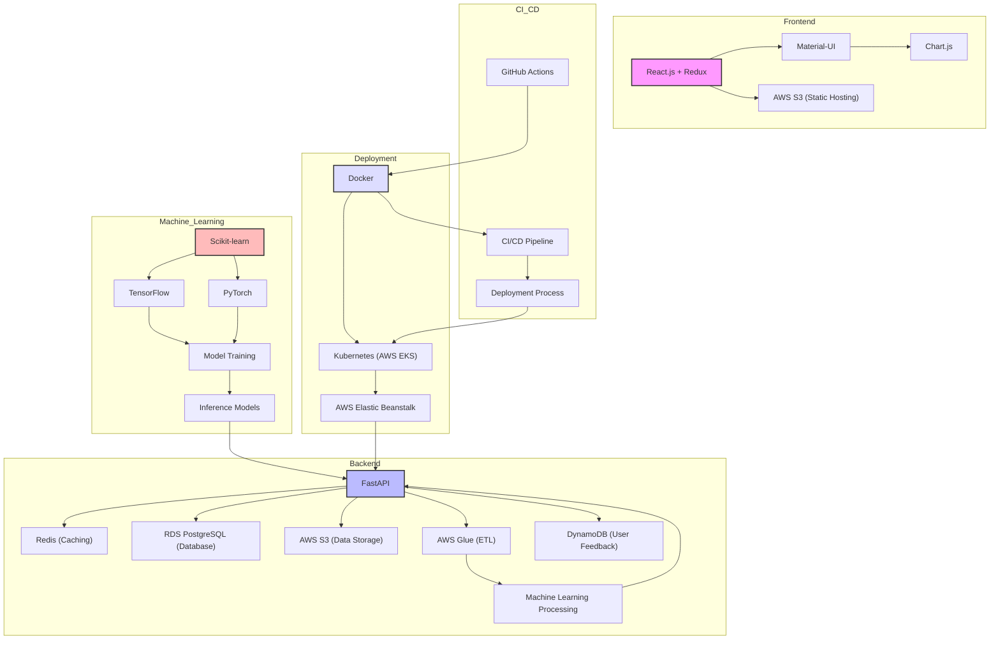

[](https://github.com/LNshuti/oil-price-dashboard/actions/workflows/ci.yml)

# Oil Price Dashboard Project

## Overview

The Oil Price Dashboard Project is designed to understand the US oil markets by forecasting prices and production quantities. This project uses data from the U.S. Energy Information Administration, focusing on the wholesale gasoline prices. The core of the analysis is performed in a Jupyter Notebook, `explore_oil_markets.ipynb`, which includes data loading, cleaning, transformation, forecasting and visualization.



## Features

- **Data Analysis**: Jupyter [Notebook]("https://github.com/LNshuti/oil-price-dashboard/blob/main/'explore_oil_markets.ipynb'") contains detailed steps for data cleaning, transformation, and preliminary analysis. 

- **Interactive Dashboard**: Integrates the analysis and visualizations into an interactive dashboard using FastAPI.

## Setup

### Create a separate environment to isolate requirements
```bash
conda env create -f environment.yaml
```

### Install requirements

```bash
pip install -r requirements.txt
```

### Activate the environment
```bash
conda activate oil-prices
```
### Run the notebook for Exploratory data analysis
```bash
jupyter notebook
```
Navigate to the explore_oil_markets.ipynb notebook and run the cells to perform the analysis and view the visualizations.

### Run the interactive Dashboard
```bash
uvicorn main:app --reload
```
#### Navigate to [http://127.0.0.1:8000/](http://127.0.0.1:8000/) to interact with the app

# References 
1. Sean Taylor. Lineapy Notebook. https://github.com/seanjtaylor/gas-price-forecast.git
